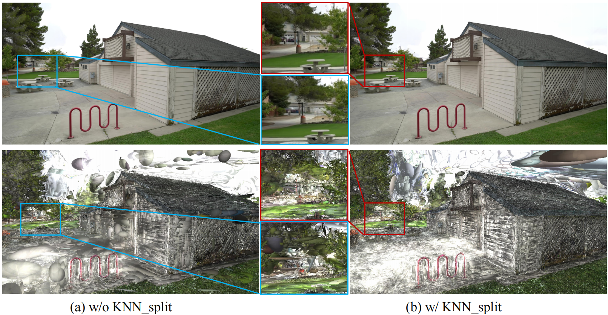

# EasySplat: View-Adaptive Learning makes 3D Gaussian Splatting Easy(ICME2025)

This project is built upon InstantSplat, extending the capabilities of DUSt3R to handle dense view scenarios.

## Contribution:
- A view-adaptive image pair construction strategy based on image similarity.
- A novel Gaussian densification approach based on K-Nearest Neighbors (KNN).

## KNN-based Densification
<p align="center">
    
</p>

## Get Started

### Installation
1. Clone EasySplat and download pre-trained model.
```bash
git clone --recursive https://github.com/Yuhuoo/EasySplat.git
cd EasySplat
git submodule update --init --recursive
cd submodules/dust3r/
mkdir -p checkpoints/
wget https://download.europe.naverlabs.com/ComputerVision/DUSt3R/DUSt3R_ViTLarge_BaseDecoder_512_dpt.pth -P checkpoints/
cd ../../
```

2. Create the environment using conda.
```bash
conda create -n easysplat python=3.11 cmake=3.14.0
conda activate easysplat
conda install pytorch torchvision pytorch-cuda=12.1 -c pytorch -c nvidia  # use the correct version of cuda for your system
pip install -r requirements.txt
pip install submodules/simple-knn
# modify the rasterizer
vim submodules/diff-gaussian-rasterization/cuda_rasterizer/auxiliary.h
'p_view.z <= 0.2f' -> 'p_view.z <= 0.001f' # line 154
pip install submodules/diff-gaussian-rasterization
```

3. Optional but highly suggested, compile the cuda kernels for RoPE (as in CroCo v2).
```bash
# DUST3R relies on RoPE positional embeddings for which you can compile some cuda kernels for faster runtime.
cd submodules/dust3r/croco/models/curope/
python setup.py build_ext --inplace
```

### Usage
```bash
  # Obtaining the initialization point cloud and camera poses.
  python dust3r_infer.py --img_base_path data/xxx/images

  # Traing the gaussians.
  python train_joint.py -s data/xxx/ -m output/xxx --optim_pose
```

## Acknowledgement

This work is built on many amazing research works and open-source projects, thanks a lot to all the authors for sharing!

- [Gaussian-Splatting](https://github.com/graphdeco-inria/gaussian-splatting) and [diff-gaussian-rasterization](https://github.com/graphdeco-inria/diff-gaussian-rasterization)
- [DUSt3R](https://github.com/naver/dust3r)
- [InstantSplat](https://github.com/NVlabs/InstantSplat)

## Citation
If you find our work useful in your research, please consider giving a star :star: and citing the following paper :pencil:.

```bibTeX
@article{gao2025easysplat,
  title={EasySplat: View-Adaptive Learning makes 3D Gaussian Splatting Easy},
  author={Gao, Ao and Guo, Luosong and Chen, Tao and Wang, Zhao and Tai, Ying and Yang, Jian and Zhang, Zhenyu},
  journal={arXiv preprint arXiv:2501.01003},
  year={2025}
}
```

